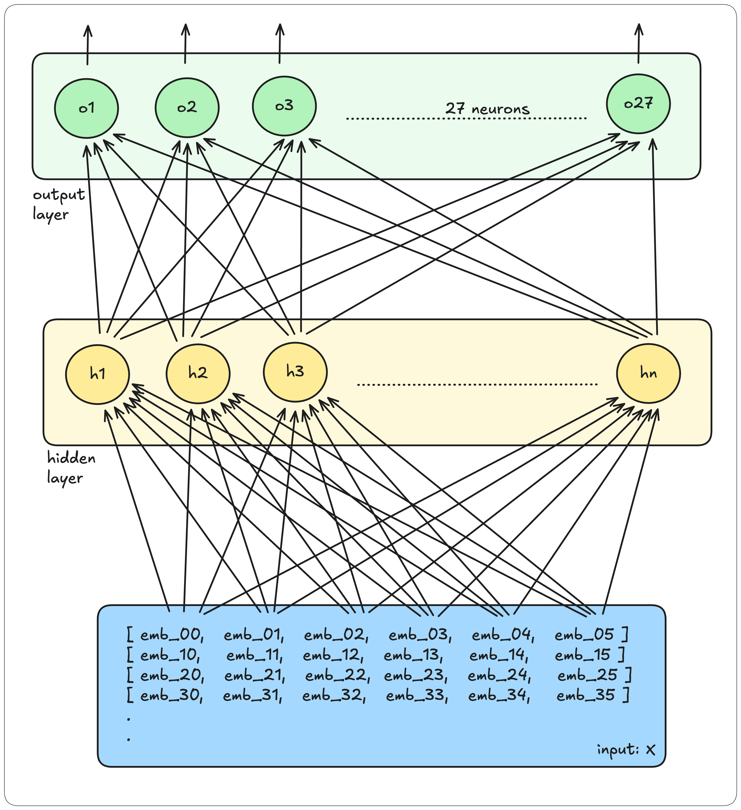
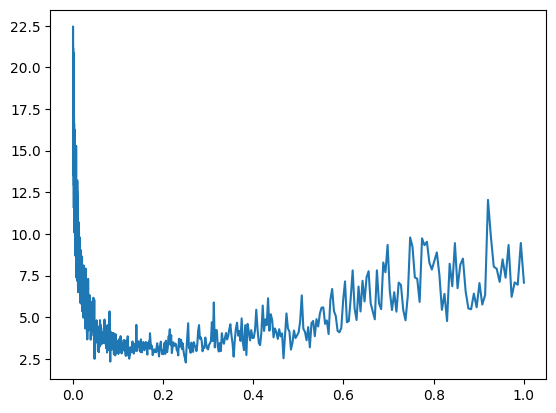
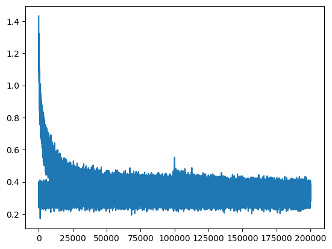
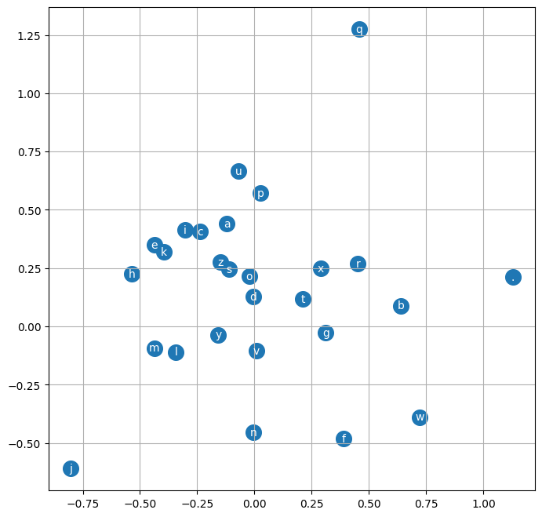

# makemore - A character level Language Model
## Episode 2: Multi-Layer Perceptron (MLP) implementation

Makemore is an auto-regressive character-level language model. It can take a text file as an input, where each line is assumed to be one training example and it generates more examples like it. New and Unknown...

This repo covers the work of Andrej's [makemore](https://github.com/karpathy/makemore/) repo with a more detailed documentation of each implementations. :smile:

This is the 2nd repo in the series where we are covering multiple implementations of **makemore**. In our previous episode we covered the [**Bigram Model**](https://github.com/SauravP97/makemore) through **Probabilities Count** and **Neural Network** implementation.We also discussed how the calculated Loss for both the implementations converged to a similar value.

The best loss achieved through our Bigram model was around `2.5` which was not that great. Hence sampling more words from that implementation sadly resulted in the meaning-less series of letters.

This time we plan to do better!

We will use the `Multi-Layer Perceptron` to build our probabilistic model to sample words and this time instead of keeping our context window of `1` word, we will increase it to `3` words.

The approach we will follow has been covered in this paper: MLP, following [Bengio et al. 2003](https://www.jmlr.org/papers/volume3/bengio03a/bengio03a.pdf).


## Implementation

To implement our model, we will need a training dataset. We build our training dataset with the help of a collection of [names](https://github.com/SauravP97/makemore/blob/master/datasets/names.txt).

***Goal The end goal is to generate / make more names similar to those present in the names dataset, but potentially never seen before in the dataset.***

Our current names dataset with approx 32K examples looks somewhat like this.

```
emma
olivia
ava
isabella
sophia
charlotte
...
```

As mentioned earlier, we will use a block-size of `3` in this approach. The context window of 3 block size will help the model to predict the next letter. This is how the datasets will look like.

```
emma
... ---> e
..e ---> m
.em ---> m
emm ---> a
mma ---> .

olivia
... ---> o
..o ---> l
.ol ---> i
oli ---> v
liv ---> i
ivi ---> a
via ---> .
```

In our dataset we will transform all these 27 characters to their indices with the help of a map.


We will use the above mapping to represent characters everywhere in our model. Let's also visualize how our initial character friendly dataset can be mapped to the actual set.


We will build a character embedding vector which will have 2 embeddings for each character. Hence our embedding vector will be a `27 x 2` matrix.

```python
# embedding vector: C
C = torch.rand((27, 2))
```

```
[       
    [0.3229, 0.7459],
    [0.3204, 0.6386],
    [0.7159, 0.8892],
    [0.4156, 0.7040],
    [0.1160, 0.0299],
    [0.8790, 0.1160],
    [0.6731, 0.6735],
    [0.6363, 0.6873],
    [0.6101, 0.0808],
    [0.1732, 0.2006],
    [0.0301, 0.8121],
    [0.9094, 0.5033],
    [0.3327, 0.8181],
    [0.3731, 0.8226],
    [0.2618, 0.3873],
    [0.7068, 0.2900],
    [0.2119, 0.2677],
    [0.5422, 0.5946],
    [0.4434, 0.9632],
    [0.9237, 0.9008],
    [0.1595, 0.8789],
    [0.0381, 0.0772],
    [0.2151, 0.0597],
    [0.6294, 0.0514],
    [0.1176, 0.2957],
    [0.4325, 0.8694],
    [0.9811, 0.4930]
]
```

Now, we will index our dataset with the embeddings so that each character in the dataset will be transformed into their 2 dimensional embedding values.

```python
C[X]
```

Our embedded vector will be of dimension `len(X) x 3 x 2` since each character in the training dataset will now have 2 embedding values picked from the embedding map `C`.


Let's flatten out the `len(X) x 3 x 2` matrix into `len(X) x 6` dimension matrix to use it further in our model.

```
[
    [0.3229, 0.7459, 0.3229, 0.7459, 0.3229, 0.7459],
    [0.3229, 0.7459, 0.3229, 0.7459, 0.8790, 0.1160],
    [0.3229, 0.7459, 0.8790, 0.1160, 0.3731, 0.8226],
    [0.8790, 0.1160, 0.3731, 0.8226, 0.3731, 0.8226],
    [0.3731, 0.8226, 0.3731, 0.8226, 0.3204, 0.6386],
    ...
]
```

Our neural network architecture will comprise of `2` layers.
One hidden layer (with n number of neurons of your choice) and one output layer having `27` neurons to represent the probability distribution of the each character coming up next.



### Train, Test and Validation Split

We want to avoid our model to entirely memorize the training dataset and sample words very very similar to the words from the input list. To achieve this we will split our dataset into Train, Test and Validation sets.

The distribution is `80%` in the Training set, `20%` in the Validation set and the remaining `20%` in the Test set.

We will use the Loss achieved in the `Test` set as our final loss and report that as the performance benchmark for this model.

```python
n1 = int(0.8 * len(words))
n2 = int(0.9 * len(words))

Xtr, Ytr = build_dataset(words[:n1])
Xdev, Ydev = build_dataset(words[n1:n2])
Xtest, Ytest = build_dataset(words[n2:])
```

```
torch.Size([182424, 3]), torch.Size([22836, 3]), torch.Size([22886, 3])
```

### Minibatch

We have a huge training set of approx `182K` datasets. We can either train a few iterations on the entire dataset or else we train a huge number of iterations on selecting a limited number of random datasets from our training sample called `Mini-Batch`.

We prefer the Mini-Batch approach.

In our model, we randomly pick `32` items from the entire pool of dataset (~182K items) in every iteration. The number 32 is configurable and can be experimented with.

```python
ix = torch.randint(0, Xtr.shape[0], (32,))
emb = C[Xtr[ix]] # shape = (32, 3, 2)
```

This is how our iterations look like.

```python
for i in range(200000):
    # minibatch
    ix = torch.randint(0, Xtr.shape[0], (32,))

    # Forward Pass
    emb = C[Xtr[ix]] # shape = (32, 3, 2)
    hidden_layer = torch.tanh(emb.view(emb.shape[0], 6) @ W1 + b1) # shape = (32, 100)
    logits = hidden_layer @ W2 + b2 # shape = (32, 27)

    loss = F.cross_entropy(logits, Ytr[ix])
    print("Loss: ", loss.item())

    # Backward Pass
    for p in parameters:
        p.grad = None

    loss.backward()

    # Update
    lr = 0.01 if i < 100000 else 0.01
    for p in parameters:
        p.data += -lr * p.grad
```

### Picking an efficient Learning Rate

We distribute our Learning Rates in the range of `[0.001 to 1]`. We pick these learning rates as we iterate over the training dataset. After training, we plot out the incurred Loss against the Learning Rates to understand the trend.



Looking at the above chart we can safely say that we have a decent learning rate between `0.01 to 0.1`.

### Calculating Loss

On training the above model for about `200K` iterations and keeping the Learning Rate at a value of `0.01` for the first `100K` iterations and `0.1` for the rest. We achieved a Loss of `2.12` (on the testing dataset).

```
tensor(2.1193, grad_fn=<NllLossBackward0>)
```

We can also visualize how the Loss dropped during our iterations.



Our current implementation produced a better loss of `2.12` as compared to our previous Bigram model which had a loss of around `2.5`.

After training, the embedding mapping has also been updated for the characters. Since we currently used a 2-dimension embedding for each character, we can visualize this.



## Sampling more Words

Let's sample more words from our trained model.

```python
# Sampling words

result = []
block_size = 3

for _ in range(20):
    block = [0] * block_size
    pred_word = []
    while True:
        Xt = torch.tensor([block])

        # Forward Pass
        embed = C[Xt] # shape = (1, 3, 2)
        hidden_layer = torch.tanh(embed.view(embed.shape[0], 30) @ W1 + b1) # shape = (32, 100)
        logits = hidden_layer @ W2 + b2 # shape = (32, 27)

        counts = torch.exp(logits)
        prob = counts / counts.sum(1, keepdims=True)

        pred_target = torch.multinomial(prob, num_samples=1, replacement=True, generator=g)
        pred_character = itos[pred_target.item()]

        if pred_character == '.':
            break

        pred_word.append(pred_character)
        block = block[1:] + [pred_target.item()]

    result.append(''.join(pred_word))

result
```

Sampled words look like this.

```
'hoda',
'shrist',
'jadeen',
'kale',
'emmeren',
'jir',
'zitia',
'azire',
'sha',
'syr',
'lyo',
'criyah',
'myah',
'jafer',
'layna',
'demileilani',
'lylenn',
'blakia',
'amari',
'fucteejahni'
```